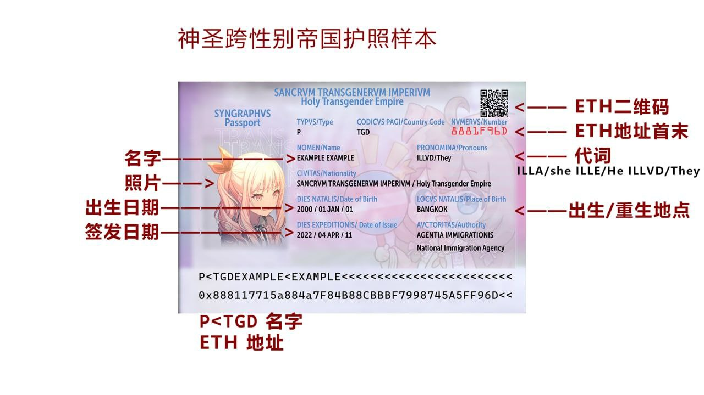

## 什么是神圣跨性别帝国？ What's the Holy Trans Empire?

- 神圣：指性别平等权益神圣不可侵犯
- 跨性别：字面意思
- 帝国：基于区块链，人人都是皇帝

- Holy -- The sacredness and inviolability of Gender-equity
- Trans -- Transgender.
- Empire -- Everyone can be the Emperor by taking advantage of Blockchain.

## Passport / 护照

### Generate 生成

项目地址：<https://github.com/saeziae/holy_trans_passport>

1. 首先你要有一个以太坊地址，并准备好私钥。\
   You MUST have your own Ethereum wallet, and prepare your private key.
1. 安装以下依赖包：`pip3 install -r requirements.txt`\
   Install the dependencies above.
1. 修改 `info.json` 内的个人信息。 \
   Fill your personal info in `info.json`:\
   - `name` -- 全名 / Full name\
     可用字符：A-Z 与空格（占一个单位）、`ÀÁÂÃÄÅÆÇÈÉÊËÌÍÎÏÐÑÒÓÔÕÖØÙÚÛÜÝÞß`（占二个单位），总共不超过 38 个单位\
     Allowed alphabets: A-Z and space (treated ad 1 unit) and `ÀÁÂÃÄÅÆÇÈÉÊËÌÍÎÏÐÑÒÓÔÕÖØÙÚÛÜÝÞß`(treated as 2 units), in total maximum 38 units
   - `birth` -- 生日 / Date of birth
   - `place` -- 出生或重生地点 / Place of Birth or Rebirth
   - `pronouns` -- 偏好的代词 / Preferred pronouns\
     推荐使用 / recommended:\
     - ELLE/He
     - ELLA/She
     - ILLVD/They
   - `hash` -- 以太坊钱包地址/ Address of Ethereum wallet
1. 替换照片 `photo.png`。建议尺寸：2:3 比例，128 x 192 或者 320 x 480\
   Replace `photo.png` with others you prefer. Recommended size: 2:3 ratio 128 x 192 or 320 x 480
1. 生成：`python generate_passport_and_pic.py info.json photo.png` \
   Generate the passport using the command above.
1. 验证护照真伪：`python view_passport.py 编号.tgdpassport`，真的才会有信息。\
   If the check for the passport is needed, run `python view_passport.py <Passport_Number>.tgdpassport`, a valid one will show the info.

## Online ID System / 线上护照信息系统

End of life.

## Catgirl Coin (NEKO) / 猫娘币

Polygon Contract: [0x5aBebe9361b7af7582b3f62E5DA9e2cabC22149c](https://polygonscan.com/token/0x5abebe9361b7af7582b3f62e5da9e2cabc22149c)
